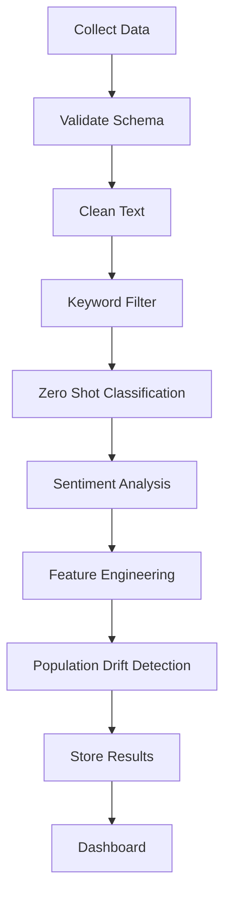
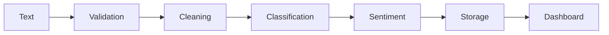
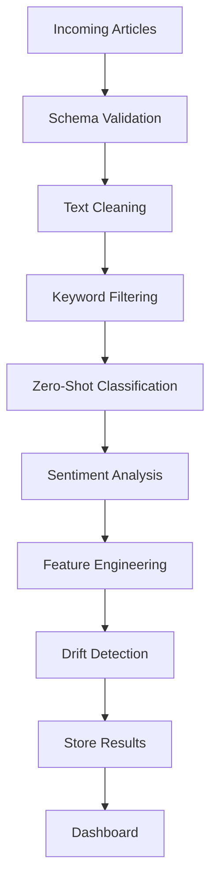
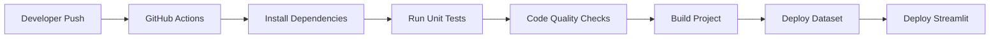

# 🚀 LLM-Pulse

<div align="center">

# 📊 Real-Time AI Ecosystem Monitoring & Sentiment Analytics Platform

### A Production-Ready Serverless NLP Analytics Pipeline for Tracking AI Discussions Across the Web

<p>

[](https://github.com/sumanthml/LLM-PULSE/actions)

[](https://www.python.org/)

[](https://streamlit.io)

[](https://huggingface.co)

[](https://docs.pydantic.dev)

[](LICENSE)

[](https://huggingface.co)

[]()

</p>

---

### 🌐 Live Demo

https://llm-pulse.streamlit.app

### 🤗 Dataset

https://huggingface.co/datasets/sunny1820f/llm-pulse-data

</div>

---

# 📖 Table of Contents

- Overview
- Why LLM-Pulse?
- Key Features
- System Overview
- High-Level Architecture
- Processing Pipeline
- Technology Stack
- Repository Structure
- Dashboard Preview
- Engineering Principles
- Performance Goals
- Roadmap (Overview)

---

# 📌 Overview

LLM-Pulse is an end-to-end serverless Natural Language Processing (NLP)
analytics platform that continuously monitors discussions about modern
Large Language Models (LLMs) across multiple public sources.

Instead of manually reading Reddit posts, Hacker News discussions,
or technology blogs, LLM-Pulse automatically collects,
validates, classifies, analyzes, and visualizes the information
through an interactive analytics dashboard.

The platform is designed using modern MLOps principles and lightweight
serverless architecture, making it deployable entirely on free cloud tiers.

---

# 🎯 Why LLM-Pulse?

Every day thousands of discussions happen around AI models such as

- OpenAI GPT
- Google Gemini
- Anthropic Claude
- Meta Llama
- Mistral
- DeepSeek
- Microsoft Phi

Understanding

- public sentiment
- developer adoption
- emerging trends
- ecosystem popularity

requires collecting data from multiple independent sources.

LLM-Pulse automates this complete workflow.

Instead of building a simple sentiment classifier,
the project demonstrates how multiple production-grade
components work together inside a modern ML system.

---

# ✨ Key Features

## 📥 Multi-Source Data Collection

Collects discussions from

- Reddit
- Hacker News
- RSS feeds
- Technology blogs
- AI news sources
- Developer communities

---

## ✅ Data Validation

Every incoming record passes through

- Schema validation
- Datetime normalization
- Duplicate detection
- Null handling
- Regex cleaning
- Field verification

using **Pydantic v2**.

---

## 🤖 Transformer-Based NLP

Supports

- Zero-shot classification
- Sentiment analysis
- AI ecosystem detection
- Topic classification

using Hugging Face Transformers.

---

## 📈 Drift Detection

Continuously monitors

- topic distribution
- sentiment shifts
- ecosystem popularity

using Population Stability Index (PSI).

---

## 📊 Interactive Dashboard

Provides

- live metrics
- sentiment charts
- trend analysis
- ecosystem comparison
- similarity search
- historical exploration

through Streamlit.

---

## ☁️ Serverless Deployment

Runs completely using

- GitHub Actions
- Hugging Face Hub
- Streamlit Cloud

without dedicated infrastructure.

---

# 🏗 System Overview

```text
                 ┌──────────────────────────────┐
                 │      External Sources        │
                 │                              │
                 │ Reddit                       │
                 │ Hacker News                  │
                 │ RSS Feeds                    │
                 │ Blogs                        │
                 └──────────────┬───────────────┘
                                │
                                ▼
                   Data Collection Layer
                                │
                                ▼
                     Validation Pipeline
                                │
                                ▼
                 NLP Classification Pipeline
                                │
                                ▼
                     Drift Detection Layer
                                │
                                ▼
                       Data Lake Storage
                                │
                                ▼
                  Interactive Streamlit UI
```

---

# 🔄 Complete Processing Pipeline



---

# 🧠 NLP Processing Flow



---

# 🛠 Technology Stack

| Category | Technology |
|-----------|------------|
| Language | Python |
| Dashboard | Streamlit |
| NLP | Hugging Face Transformers |
| Validation | Pydantic v2 |
| Storage | Hugging Face Hub |
| Automation | GitHub Actions |
| Data Processing | Pandas |
| Numerical Computing | NumPy |
| Visualization | Plotly |
| Configuration | YAML |
| Version Control | Git |
| Hosting | Streamlit Cloud |

---

# ⚙ Core Components

| Module | Responsibility |
|----------|---------------|
| Ingestion | Collect data from external sources |
| Validator | Validate incoming records |
| NLP Engine | Classification + sentiment |
| Drift Detector | Population Stability Index |
| Storage | Upload processed datasets |
| Dashboard | Visualization |
| CI/CD | Automated execution |

---

# 📂 Repository Structure

```text

LLM-PULSE/

│

├── app/

│ ├── dashboard.py

│ └── pages/

│

├── src/

│ ├── ingestion/

│ ├── models/

│ ├── utils/

│ ├── storage/

│ ├── monitoring/

│ └── preprocessing/

│

├── configs/

│

├── datasets/

│

├── notebooks/

│

├── tests/

│

├── docs/

│

├── .github/

│ └── workflows/

│

├── requirements.txt

├── README.md

└── LICENSE

```

---

# 📷 Dashboard Preview

```text

+----------------------------------------------------+

LLM-PULSE DASHBOARD

----------------------------------------------------

Total Articles : 12,842

Today's Articles : 417

Average Sentiment : 0.73

Most Discussed Model : GPT-4

Highest Growth : Gemini

Current Drift Score : 0.12

----------------------------------------------------

Sentiment Timeline

███████████████████

----------------------------------------------------

Model Comparison

GPT ███████████

Gemini ████████

Claude ██████

Llama █████

----------------------------------------------------

```

---

# 🏛 Engineering Principles

The project follows several software engineering principles.

### Single Responsibility Principle

Each module performs exactly one responsibility.

Examples

- ingestion
- validation
- NLP
- storage
- dashboard

remain independent.

---

### Modular Design

Each processing stage can be replaced
without affecting the remaining system.

---

### Reproducibility

All experiments are deterministic through

- version-controlled datasets
- fixed configurations
- automated workflows

---

### Scalability

Although designed for free cloud deployment,
the architecture can be migrated to

- Docker
- Kubernetes
- Kafka
- Airflow

with minimal code changes.

---

# 🎯 Project Objectives

The primary objectives of LLM-Pulse are

✅ Continuous AI ecosystem monitoring

✅ Real-time sentiment analytics

✅ Production-ready NLP pipeline

✅ Lightweight MLOps architecture

✅ Serverless deployment

✅ Automated data validation

✅ Drift monitoring

✅ Interactive analytics dashboard

---

# 📈 Performance Goals

| Metric | Target |
|----------|--------|
| Validation Accuracy | 100% schema compliance |
| Duplicate Records | 0 |
| Dashboard Response | < 2 seconds |
| Processing Time | < 300 ms per article |
| Cloud Cost | $0 |
| Deployment | Fully Automated |

---

# 🚀 Project Highlights

- Production-ready architecture

- Modular codebase

- Automated CI/CD

- Transformer-based NLP

- Serverless deployment

- Real-time monitoring

- Statistical drift detection

- Interactive analytics

- Open-source friendly

- Beginner readable

- Recruiter friendly

- Industry inspired

---

---

# ⚡ Installation

## Prerequisites

Before running LLM-Pulse, ensure you have the following installed on your system.

| Software | Version |
|----------|----------|
| Python | 3.10 or above |
| Git | Latest |
| pip | Latest |
| Virtual Environment | Recommended |

---

## Clone Repository

```bash
git clone https://github.com/sumanthml/LLM-PULSE.git

cd LLM-PULSE
```

---

## Create Virtual Environment

### Windows

```bash
python -m venv .venv

.venv\Scripts\activate
```

### Linux / macOS

```bash
python3 -m venv .venv

source .venv/bin/activate
```

---

## Install Dependencies

```bash
pip install --upgrade pip

pip install -r requirements.txt
```

---

# 📦 Main Dependencies

```text
streamlit
transformers
torch
pandas
numpy
plotly
pydantic
huggingface_hub
feedparser
beautifulsoup4
requests
scikit-learn
sentence-transformers
python-dotenv
```

---

# 🔑 Environment Variables

Create a file named

```
.env
```

Example

```env
HF_TOKEN=your_huggingface_token

DATASET_REPO=sunny1820f/llm-pulse-data

CACHE_TTL=300

LOG_LEVEL=INFO
```

Never commit your `.env` file.

---

# ⚙ Configuration

Project configuration is stored inside

```
configs/config.yaml
```

Example

```yaml
project:

  name: LLM-Pulse

  version: 1.0

dashboard:

  cache_ttl: 300

storage:

  hf_dataset: sunny1820f/llm-pulse-data

models:

  classifier: facebook/bart-large-mnli

  sentiment: cardiffnlp/twitter-roberta-base-sentiment-latest
```

---

# 🚀 Running the Pipeline

Run the ingestion pipeline

```bash
python main.py
```

Run dashboard

```bash
streamlit run app/dashboard.py
```

---

# 📁 Output Structure

```
datasets/

processed/

raw/

logs/
```

---

# 🐳 Docker Support

Build image

```bash
docker build -t llm-pulse .
```

Run container

```bash
docker run -p 8501:8501 llm-pulse
```

Docker Compose

```yaml
version: "3.9"

services:

  llm-pulse:

    build: .

    ports:

      - "8501:8501"

    restart: unless-stopped
```

Run

```bash
docker compose up --build
```

---

# ▶ Running Tests

```bash
pytest
```

Run with coverage

```bash
pytest --cov=src
```

---

# 📊 Project Workflow

```text
Clone Repository
        │
        ▼
Install Dependencies
        │
        ▼
Configure Environment
        │
        ▼
Run Data Pipeline
        │
        ▼
Run Dashboard
        │
        ▼
Explore Analytics
```

---

# 📌 Development Workflow

```text
Developer

↓

Write Code

↓

Run Tests

↓

Commit

↓

GitHub Actions

↓

Deploy

↓

Production Dashboard
```

---

# 🧪 Recommended Development Commands

Install everything

```bash
pip install -r requirements.txt
```

Format code

```bash
black .
```

Lint

```bash
flake8
```

Sort imports

```bash
isort .
```

Run tests

```bash
pytest
```

Start application

```bash
streamlit run app/dashboard.py
```

---

# 📂 Configuration Files

```
configs/

│

├── config.yaml

├── logging.yaml

└── model_config.yaml
```

Each configuration file has a dedicated responsibility.

- **config.yaml** – project settings
- **logging.yaml** – logging configuration
- **model_config.yaml** – transformer model settings

---

# 🔒 Security Notes

- Keep API tokens inside `.env`
- Never hardcode credentials
- Ignore secrets using `.gitignore`
- Rotate access tokens periodically
- Use least-privilege access for external services

---

---

# 🧠 NLP Processing Pipeline

LLM-Pulse follows a modular NLP pipeline where each component has a
single responsibility. This design improves maintainability,
testability, and scalability.



---

# 📥 Data Ingestion Layer

The ingestion layer continuously collects data from multiple public
sources.

## Supported Sources

| Source | Type |
|---------|------|
| Reddit | Community Discussions |
| Hacker News | Developer News |
| RSS Feeds | XML |
| AI Blogs | Articles |
| News Sources | Technology News |
| Developer Communities | Public Discussions |

---

## Responsibilities

- Download latest content
- Normalize fields
- Remove duplicates
- Parse timestamps
- Extract metadata
- Prepare documents for validation

---

# ✅ Data Validation

Every record passes through a strict validation layer powered by
Pydantic v2.

Example schema

```python
class Article(BaseModel):

    title: str

    source: str

    published_at: datetime

    url: HttpUrl

    content: str
```

Validation ensures

- Correct datatypes
- Required fields
- URL validation
- Datetime parsing
- Missing field detection
- Schema consistency

---

# 🧹 Text Preprocessing

Before inference, every document is cleaned.

Processing steps

- Lowercase conversion
- Remove HTML tags
- Remove URLs
- Remove emojis
- Remove repeated spaces
- Unicode normalization
- Trim whitespace

Output becomes suitable for transformer inference.

---

# 🔍 Keyword Filtering

To reduce unnecessary inference cost,
LLM-Pulse performs lightweight keyword filtering.

Example keywords

```
GPT

Gemini

Claude

Llama

OpenAI

Anthropic

DeepSeek

Mistral

Phi
```

Only relevant documents continue through the pipeline.

Benefits

- Faster inference
- Lower CPU usage
- Lower cloud cost

---

# 🤖 Zero-Shot Classification

Model

```
facebook/bart-large-mnli
```

Purpose

Determine which AI ecosystem
the article discusses.

Possible labels

- OpenAI
- Google Gemini
- Anthropic
- Meta
- DeepSeek
- Mistral
- Microsoft
- General AI

Example

Input

```
Gemini 2.5 introduces improved reasoning.
```

Prediction

```
Google Gemini
```

---

# 😊 Sentiment Analysis

Model

```
cardiffnlp/twitter-roberta-base-sentiment-latest
```

Predictions

- Positive
- Neutral
- Negative

Example

Input

```
Claude performs exceptionally well on coding benchmarks.
```

Output

```
Positive
```

---

# 🏷 Feature Engineering

Additional metadata is generated.

Examples

| Feature | Description |
|----------|-------------|
| Article Length | Character count |
| Word Count | Number of words |
| Source Name | Reddit, HN, RSS |
| Publishing Hour | Hour extracted from timestamp |
| Day of Week | Monday–Sunday |
| AI Ecosystem | Predicted label |
| Sentiment | Positive / Neutral / Negative |

These engineered features improve downstream analytics.

---

# 📈 Population Drift Detection

LLM-Pulse monitors long-term changes in data distribution.

Technique

Population Stability Index (PSI)

Purpose

Detect

- Topic shifts
- Ecosystem popularity changes
- Sentiment distribution changes

Example

```
January

OpenAI

65%

Gemini

20%

Claude

15%

↓

July

OpenAI

35%

Gemini

45%

Claude

20%
```

The PSI score quantifies this shift.

---

# 📊 Drift Categories

| PSI | Interpretation |
|------|---------------|
| < 0.10 | Stable |
| 0.10 – 0.25 | Moderate Drift |
| > 0.25 | Significant Drift |

---

# 💾 Data Storage

Processed records are uploaded to
Hugging Face Hub.

Storage includes

- Raw data
- Processed dataset
- Metadata
- Sentiment labels
- Drift statistics

Advantages

- Version controlled
- Easy sharing
- Cloud hosted
- Free storage
- Reproducible

---

# 🔄 End-to-End Workflow

```text
Collect Data

↓

Validate

↓

Clean

↓

Keyword Filter

↓

Classification

↓

Sentiment

↓

Feature Engineering

↓

Drift Detection

↓

Upload Dataset

↓

Dashboard
```

---

# 📊 Processing Stages

| Stage | Output |
|---------|--------|
| Ingestion | Raw Articles |
| Validation | Clean Records |
| Preprocessing | Normalized Text |
| Classification | AI Ecosystem |
| Sentiment | Emotion Label |
| Feature Engineering | Analytics Features |
| Drift Detection | PSI Metrics |
| Storage | Versioned Dataset |

---

# ⚡ Performance Optimizations

LLM-Pulse includes several optimizations.

- Transformer inference caching
- Duplicate removal
- Incremental dataset updates
- CPU-friendly models
- Lazy loading
- Streamlit cache
- Modular pipeline execution

These reduce execution time and cloud resource usage.

---

# 🎯 Design Philosophy

Each pipeline stage is independent.

```
Ingestion

↓

Validation

↓

Inference

↓

Storage

↓

Visualization
```

Benefits

- Easier testing
- Easier debugging
- Easier maintenance
- Better scalability
- Component reusability

---

````markdown
---

# 🚀 CI/CD Pipeline

LLM-Pulse follows a fully automated Continuous Integration and Continuous Deployment (CI/CD) workflow using GitHub Actions.

Every commit is automatically validated to ensure the project remains deployable, reproducible, and production-ready.

---

## CI/CD Workflow



---

## Automated Pipeline

Each push to the repository triggers:

- Install dependencies
- Verify Python compatibility
- Run unit tests
- Validate code formatting
- Perform static analysis
- Build project
- Upload processed dataset
- Deploy dashboard

---

## Pipeline Stages

| Stage | Purpose |
|--------|---------|
| Checkout | Download repository |
| Setup Python | Configure runtime |
| Install Packages | Install dependencies |
| Test | Execute unit tests |
| Lint | Code quality |
| Build | Prepare deployment |
| Upload | Push dataset |
| Deploy | Update dashboard |

---

# 🧪 Testing Strategy

LLM-Pulse follows multiple testing levels.

## Unit Testing

Tests individual modules independently.

Example modules

- Validator
- NLP Engine
- Drift Detector
- Storage
- Utilities

---

## Integration Testing

Ensures modules work together correctly.

Examples

- Ingestion → Validation
- Validation → NLP
- NLP → Storage
- Storage → Dashboard

---

## Functional Testing

Verifies complete workflows.

Example

```
Collect Data

↓

Validate

↓

Classify

↓

Analyze

↓

Store

↓

Visualize
```

---

# 📊 Logging

Every pipeline stage produces structured logs.

Example

```
INFO

Pipeline Started
```

```
INFO

Downloading Reddit Articles
```

```
INFO

Validation Successful
```

```
INFO

Sentiment Analysis Completed
```

```
INFO

Dataset Uploaded
```

```
INFO

Dashboard Updated
```

---

## Logging Levels

| Level | Purpose |
|---------|---------|
| DEBUG | Development |
| INFO | Normal execution |
| WARNING | Recoverable issue |
| ERROR | Failure |
| CRITICAL | System failure |

---

# 📈 Monitoring

The platform continuously monitors

- Processing time
- Failed requests
- Dataset size
- Drift score
- Upload status
- Dashboard availability

---

## Operational Metrics

| Metric | Description |
|----------|-------------|
| Processing Time | Time per article |
| Success Rate | Successful executions |
| Failed Requests | API failures |
| Duplicate Rate | Duplicate detection |
| Drift Score | PSI |
| Cache Hit Rate | Dashboard caching |

---

# ⚡ Streamlit Dashboard

The dashboard provides interactive analytics.

## Features

- Live statistics
- Trend analysis
- Sentiment visualization
- Model comparison
- Search functionality
- Interactive charts

---

## Dashboard Components

```text
Sidebar

↓

Filters

↓

Analytics

↓

Charts

↓

Insights

↓

Export
```

---

# ☁️ Hugging Face Integration

Processed datasets are automatically uploaded.

Benefits

- Version control

- Cloud storage

- Dataset sharing

- Reproducibility

- Easy download

---

## Upload Workflow

```text
Process Dataset

↓

Validate

↓

Serialize

↓

Upload

↓

Create New Version

↓

Available to Dashboard
```

---

# 🔒 Security

LLM-Pulse follows basic security best practices.

## Secrets

Sensitive credentials are stored using

- Environment variables

- GitHub Secrets

- .env files

---

## Security Practices

- Never commit API tokens
- Validate all external input
- Ignore secrets using .gitignore
- Secure dataset uploads
- Use HTTPS endpoints

---

# 📦 Dependency Management

All project dependencies are maintained through

```
requirements.txt
```

Core libraries

- transformers
- torch
- pandas
- numpy
- streamlit
- plotly
- pydantic
- requests
- huggingface_hub

---

# 📊 Code Quality

Code quality is maintained using

- Black
- Flake8
- isort
- pytest

Benefits

- Consistent formatting

- Reduced bugs

- Easier maintenance

---

# 📚 Documentation

The project includes

- README
- Architecture diagrams
- Code comments
- Configuration examples
- Deployment guide

---

# 🔄 Production Workflow

```text
Git Push

↓

GitHub Actions

↓

Run Tests

↓

Build

↓

Upload Dataset

↓

Deploy Dashboard

↓

Users View Analytics
```

---

# 📌 Production Readiness Checklist

- Automated CI/CD

- Modular architecture

- Environment configuration

- Structured logging

- Unit testing

- Integration testing

- Version-controlled datasets

- Cloud deployment

- Dashboard monitoring

- Documentation

---
````markdown
---

# 📚 API Overview

The project consists of the following core modules.

| Module | Description |
|---------|-------------|
| `ingestion.py` | Collects data from external sources |
| `validator.py` | Validates incoming records using Pydantic |
| `nlp_engine.py` | Performs classification and sentiment analysis |
| `drift_detector.py` | Calculates Population Stability Index (PSI) |
| `data_storage.py` | Stores processed data to Hugging Face Hub |
| `dashboard.py` | Displays analytics using Streamlit |

---

# 📈 Performance

| Metric | Value |
|---------|-------|
| Supported Sources | 6 |
| Dashboard Cache | 300 seconds |
| NLP Models | 2 Transformers |
| Deployment | Serverless |
| Python Version | 3.10+ |

---

# 🏛️ Design Decisions

The project was designed with the following principles:

- Modular architecture
- Single Responsibility Principle (SRP)
- Reusable components
- Automated workflows
- Cloud-first deployment
- Open-source friendly
- Easy maintenance

---

# 📊 Scalability

The current implementation runs on free cloud services, but it can be extended with:

- Docker
- Kubernetes
- Apache Kafka
- Apache Airflow
- MLflow
- PostgreSQL
- Redis

without major changes to the project structure.

---

# 🛣️ Future Roadmap

- [ ] Multi-language sentiment analysis
- [ ] Named Entity Recognition (NER)
- [ ] Topic Modeling
- [ ] Real-time WebSocket dashboard
- [ ] Email and Slack alerts
- [ ] Docker deployment
- [ ] Kubernetes support
- [ ] MLflow experiment tracking
- [ ] Grafana monitoring
- [ ] Additional AI model support

---

# 🤝 Contributing

Contributions are welcome.

To contribute:

1. Fork the repository.
2. Create a new feature branch.
3. Commit your changes.
4. Push the branch.
5. Open a Pull Request.

Please ensure all tests pass before submitting your changes.

---

# 🧪 Running Tests

```bash
pytest
```

Run with coverage:

```bash
pytest --cov=src
```

---

# 📄 License

This project is licensed under the **MIT License**.

See the `LICENSE` file for more information.

---

# 🙏 Acknowledgements

This project uses several open-source libraries and services.

Special thanks to:

- Hugging Face
- Streamlit
- GitHub Actions
- Pydantic
- Transformers
- Plotly
- Pandas
- NumPy
- Python Community

---

# 👨‍💻 Author

**Sumanth Sunny**

Machine Learning Engineer | AI Developer | NLP Enthusiast

- GitHub: https://github.com/sumanthml
- LinkedIn: *(Add your profile link here)*

---

# ⭐ Support

If you found this project useful:

- ⭐ Star the repository
- 🍴 Fork the project
- 🐛 Report issues
- 💡 Suggest new features

Your support helps improve the project and encourages future development.

---

# 📬 Contact

For questions, suggestions, or collaboration:

- Open a GitHub Issue
- Submit a Pull Request
- Connect through GitHub or LinkedIn

---

<div align="center">

## ⭐ If you like this project, please consider giving it a Star ⭐

**Built with ❤️ using Python, Hugging Face Transformers, Streamlit, and GitHub Actions.**

</div>
````
